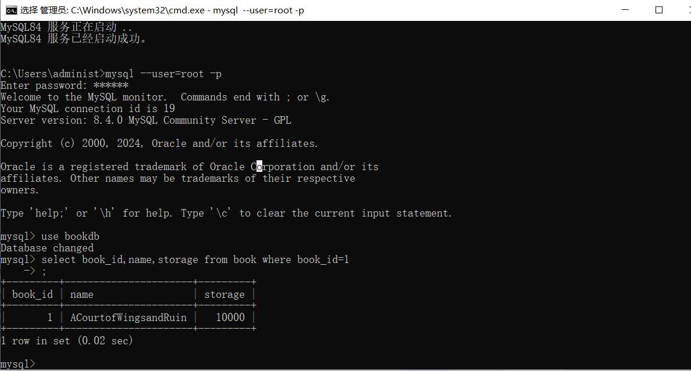
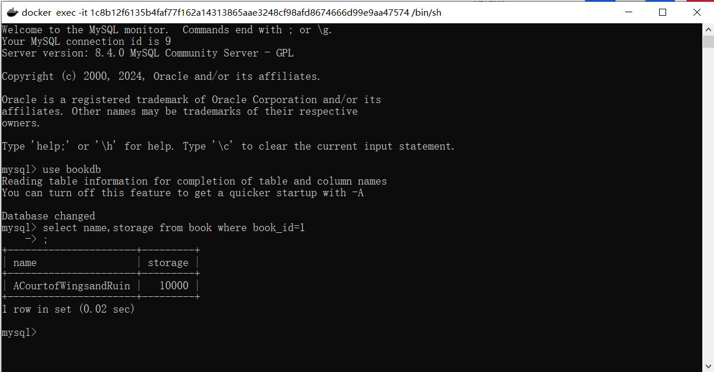
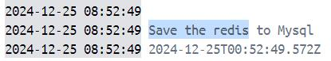

# HW11

使用docker部署后端与Mysql数据库。

## Dockerfile

首先我们需要创建两个dockerfile:Dockerfile.main与Dockerfile.mysql，main中使用基础镜像openjdk:21-jdk-slim, mysql使用镜像mysql:8.4.0(与原有的mysql版本一致)

### Dockerfile.main

首先设定一下工作目录，我们都将后端的源代码放到/home/main中。

```dockerfile
RUN mkdir -p /home/main
RUN chmod -R 777 /home/main

WORKDIR /home/main
```

main中我们使用jar包的方式运行后端，添加entrypoint`ENTRYPOINT ["sh" , "-c" , "java -jar ./target/main-process-0.0.1-SNAPSHOT.jar"]`。

### Dockerfile.mysql

在mysql中，我们添加一些环境变量。因为使用已有的数据库，不需要传递密码，同时需要传递环境变量`DATABASE_ALREADY_EXISTS="1"`。

另外，因为主机的系统为windows，而容器的系统是Linux，主机的默认配置中lower_case_table_names=1，而linux中默认配置为lower_case_table_names=2，需要修改配置。另外，在主机与mysql通信时，原先数据库默认只接收本地连接，而container化后数据库认为主机的连接属于一种外部连接，会拒绝访问。修改bind-address=0.0.0.0来接收所有连接。

我们通过传递配置文件到容器中的方式来修改容器中mysql的配置，这个配置文件的默认位置在/etc/mysql/conf.d/my.cnf。

```Dockerfile
ENV DATABASE_ALREADY_EXISTS="1"
COPY my.ini /etc/mysql/conf.d/my.cnf
```

```ini
# my.ini
[mysqld]
lower_case_table_names=1
bind-address=0.0.0.0
```

### docker-compose.yml与bind-mount

使用docker-compose的配置来配置bind-mount。mysql的数据默认放在/var/lib/mysql，将本地的数据文件映射过去。

```yml 
main_server:  
    ...
    volumes:  
    - ..:/home/main  
  mysql_server:  
    volumes:  
      - MySQLDataDir:/var/lib/mysql  
```

mysql基础镜像的默认entrypoint是mysql自带的一个脚本，其中会对数据库进行初始化等操作，因为不需要重新初始化，所以修改entrypoint为mysqld，并重新指定DataDir。

```yml
entrypoint: mysqld --datadir="/var/lib/mysql/Data"
```

在容器中写入之后，主机的数据库也可以观察到修改。如下，在容器中修改库存，关闭容器后连接主机的数据库，可以查看到新的库存。

{修改库存}

{查看库存}

尝试删除容器，再重新创建新的容器。

{查看库存}

依然可以看到最新的结果。

### 配置Main容器连接主机。

因为依然有部分服务没有容器化，为了访问主机的位置，在docker-compose中添加extra-hosts来添加主机的位置，使用host.docker.internal来代表主机位置。

```yml
    # docker-compose
    extra_hosts:
      - "host.docker.internal:host-gateway"
    # application.yml
    mongodb:
      uri: mongodb://host.docker.internal:27017/bookcover
    redis: 
      database : 0
      host : host.docker.internal
    ...
```

可以正常地在容器中访问到mongod和redis等主机上的服务。mongod中存放的是图书的封面，可以正常地查询。redis可以正常缓存。

{访问mangod}

{访问redis}